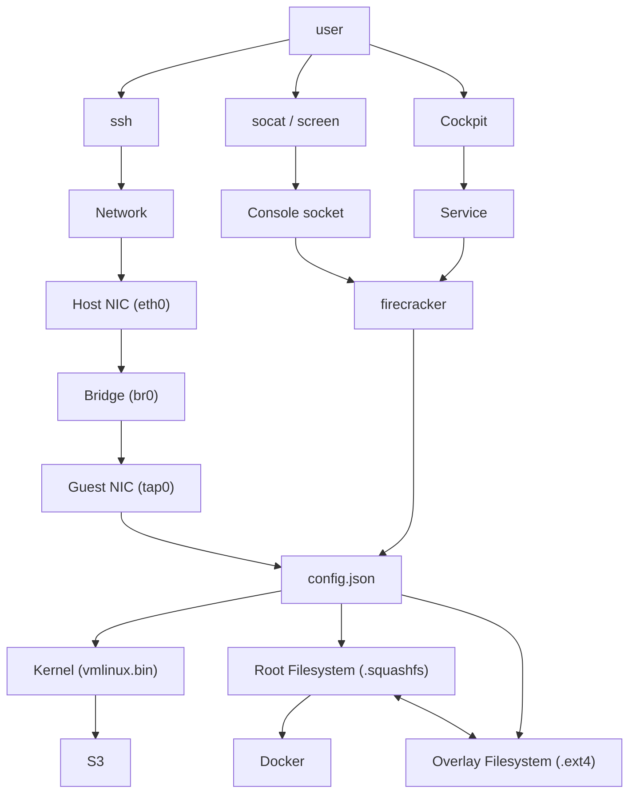

# Firecracker

Firecracker creates MicroVMs which have minimal VirtIO devices and boot in milliseconds.

To use as a hypervisor with a decent user experience, I've wrapped the VMs inside a service to control logging and start/stop, installed Cockpit to manage these services, and created a Terraform module to handle the configuration files and service creation. VMs share kernels and read-only root filesystems with copy-on-write overlay filesystems added to persist changes.

## Components of a Micro-VM

- kernel image, uncompressed (vmlinux.bin)
- rootfs (disk image - .ext4)
- tap network adapter
- serial console (ttyS0)
- firecracker config file (.json)
- systemd service definition (.service)

### Diagram



## To-do

- [x] Create Debian VM
- [x] Deploy firecracker with ansible
- [x] Download hello-world images
- [x] Run VM via command line
- [x] Update iptables and make persistent
- [x] Create tap as persistent using /etc/network/interfaces.d and ifup
- [x] Connect VM to internet
- [x] Install dhcp
- [x] Create terraform module to deploy MicroVM as files and services (neuspaces/system)
- [x] Create terraform user `terraform` with passwordless sudo
- [x] File share (`smb`) on hypervisor to allow image upload
- [x] Test multiple concurrent VMs with a serial console each
- [x] Include example files in documentation
- [x] Include diagram in documentation
- [ ] Include example commands in documentation
- [x] Kernel option `no pci`?
- [x] 3rd NIC for VM to simulate domain bridge
- [x] Create [Alpine image](https://hans-pistor.tech/posts/building-a-rootfs-for-firecracker/)
- [x] Add network interface and dhcp to Alpine image
- [x] Pin Alpine image to version (cli arg -> Docker tag)
- [x] Restructure repo to have 1 folder for rootfs build with multiple Dockerfiles
- [x] Update `build` task to accept Dockerfile and version arguments
- [x] Create [Ubuntu image](https://github.com/firecracker-microvm/firecracker/blob/main/tools/functions) in same folder using the same scripts
- [x] Check if Terraform can get platform slug from netbox - use as filename
- [x] Add [OverlayFS](https://e2b.dev/blog/scaling-firecracker-using-overlayfs-to-save-disk-space) to Alpine image
- [x] Update Terraform module for RO squashfs and creation of RW overlay
- [x] Add OverlayFS to Ubuntu image
- [x] Create Debian image
- [ ] Create Fedora/Rocky image
- [x] Concurrent VM test - ansible patching run
- [ ] Shell script to automate download/update of CI kernels
- [ ] Autobase cluster test
- [ ] FreeBSD VM to create kernel and rootfs images
- [x] Deploy to bare metal
- [ ] Add support to `start`/`stop` ansible roles
- [ ] Test additional disks
- [ ] Test additional NICs
- [ ] Test attaching to the VM console (`socat`):
```sh
# create 1
socat UNIX-LISTEN:/tmp/console.sock,fork EXEC:"firecracker --api-sock /tmp/api.sock"
# attach 1
socat -,raw,echo=0 UNIX-CONNECT:/tmp/console.sock

# create 2
socat -d -d PTY,link=/tmp/firecracker-console,raw,echo=0 EXEC:"firecracker --api-sock /tmp/api.sock"
# attach 2
screen /tmp/firecracker-console

# neither of these have been tested, they are suggestions from the internet
```
- [ ] Create Talos image
- [ ] Add `deploy` task to send created images to Firecracker host

## Host setup

- Create a `firecracker` user and group
- Install `bridge-utils` and `iptables-persistent`
- Install a `firecracker` binary
- Create a bridge network
```sh
# /etc/network/interfaces
auto lo
iface lo inet loopback

# Management NIC
allow-hotplug ens18
iface ens18 inet dhcp

# Guest NIC
allow-hotplug ens19
iface ens19 inet manual

# Guest Bridge
auto br0
iface br0 inet manual
    bridge-ports ens19
    bridge-stp off
    bridge-fd 0

source /etc/network/interfaces.d/*
```
- Enable NAT
```sh
iptables --table nat --append POSTROUTING --out-interface ens19 -j MASQUERADE
iptables --insert FORWARD --in-interface br0 -j ACCEPT
```
- Make NAT persistent
```sh
sudo iptables-save | sudo tee /etc/iptables/rules.v4
```

## Guest Setup

### Downloading a Kernel

- Get Firecracker version (`firecracker --version`)
- Get list of CI kernels ([v.1.13 example](http://spec.ccfc.min.s3.amazonaws.com/?prefix=firecracker-ci/v1.13/x86_64/vmlinux-&list-type=2))
- Download latest to `vmlinux.bin` ([v6.1.141 example](http://spec.ccfc.min.s3.amazonaws.com/firecracker-ci/v1.13/x86_64/vmlinux-6.1.141))

<!-- TODO: bash script to get firecracker version and download major kernels for it -->

### Building a Filesystem

Run the build task:
```sh
task build IMAGE=alpine VERSION=3.23
```

This will create `output/alpine-3.23.ext4` (filesystem for RW use) and `output/alpine-3.23.img` (squashfs for RO overlay use)

### Testing a Filesystem

Run the test task:
```sh
task test IMAGE=alpine VERSION=3.23
```

This will run a VM locally with the squashfs image and an overlay filesystem in RAM (no persistence).

To persist between reboots:
- update `config.json`
  - Console arguments: change `overlay_root=ram` to `overlay_root=vdb`
  - Add definition of 2nd disk to `drives`:
```json
{
  "drive_id": "overlayfs",
  "path_on_host": "output/overlay.ext4",
  "is_root_device": false,
  "partuuid": null,
  "is_read_only": false,
  "cache_type": "Unsafe",
  "rate_limiter": null
}
```
  - create `overlay.ext4` file:
```sh
dd if=/dev/zero of=rootfs/output/overlay.ext4 conv=sparse bs=1M count=1024
mkfs.ext4 rootfs/output/overlay.ext4
```

To use a writeable filesystem:

- update `config.json` root drive
  - Change `.img` to `.ext4` on `path_on_host`
  - Change `read_only` to false

### Running a VM

- Create a tap interface
```sh
# /etc/network/interfaces.d/tap0
iface tap0 inet manual
  pre-up /sbin/ip tuntap add mode tap user firecracker name $IFACE || true
  pre-up /sbin/ip link set dev $IFACE master br0
  up /sbin/ip link set dev $IFACE up
  post-down /sbin/ip link del dev $IFACE || true
```
- bring interface up
```sh
ifup tap0
```
- Create a VM config file
```json
// /opt/firecracker/vm/vm00/config.json
{
  "boot-source": {
    "kernel_image_path": "vmlinux.bin",
    "boot_args": "console=ttyS0 reboot=k panic=1",
    "initrd_path": null
  },
  "drives": [
    {
      "drive_id": "rootfs",
      "partuuid": null,
      "is_root_device": true,
      "cache_type": "Unsafe",
      "is_read_only": false,
      "path_on_host": "rootfs.ext4",
      "io_engine": "Sync",
      "rate_limiter": null,
      "socket": null
    }
  ],
  "machine-config": {
    "vcpu_count": 2,
    "mem_size_mib": 1024,
    "smt": false,
    "track_dirty_pages": false,
    "huge_pages": "None"
  },
  "cpu-config": null,
  "balloon": null,
  "network-interfaces": [
    {
      "iface_id": "eth0",
      "guest_mac": "00:de:ad:be:ef:00",
      "host_dev_name": "tap0"
    }
  ],
  "vsock": null,
  "logger": null,
  "metrics": null,
  "mmds-config": null,
  "entropy": null,
  "pmem": [],
  "memory-hotplug": null
}
```
- Run firecracker as unprivileged user
```sh
firecracker --no-api --config-file config.json
```

### Stopping

To stop a MicroVM it must be rebooted

## Hello world image testing

[Gist with script and links](https://gist.github.com/jvns/c8470e75af67deec2e91ff1bd9883e53) - not mine

- No DHCP, need to edit `/etc/network/interfaces` to use static IP initially
```sh
auto eth0
iface eth0 inet static
    address 192.168.88.5
    netmask 255.255.255.0
    gateway 192.168.88.1
```
- Start eth0 with `ifup eth0`
- Update sources, install and enable DHCP, SSH and sudo
```sh
apk update
apk add openssh-server
mkdir -p /var/run/sshd
vi /etc/ssh/sshd_config # uncomment "Password authentication yes"
rc-service sshd start
rc-update add ssh

apk add dhcpcd
rc-service dhcpcd start
rc-update add dhcpcd

apk add sudo
adduser ansible
adduser ansible wheel
visudo # uncomment "%wheel ALL=(ALL) ALL"
```
- Switch networking to DHCP in `/etc/network/interfaces`
```sh
auto eth0
iface eth0 inet dhcp
```
- Reboot
- Connect via SSH

### Issues

- No DHCP in hello world image - need to set IP manually
- `eth0` has to be started manually even after updating `/etc/network/interfaces` - this could be DHCP related, TODO: try static config
- MicroVM can ping router, and laptop can ping MicroVM, but MicroVM cannot access the internet. No SSH installed so can't test inbound connection

### Notes

#### Rocky Package List

```sh
RUN dnf -y update && \
    dnf -y install \
        systemd \
        iproute \
        iputils \
        sudo \
        vim \
        curl \
        which \
    && dnf clean all
```